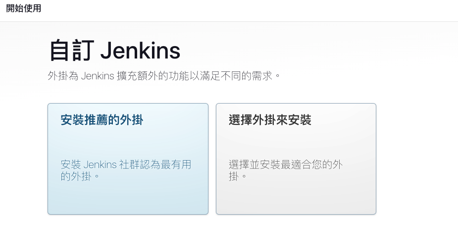
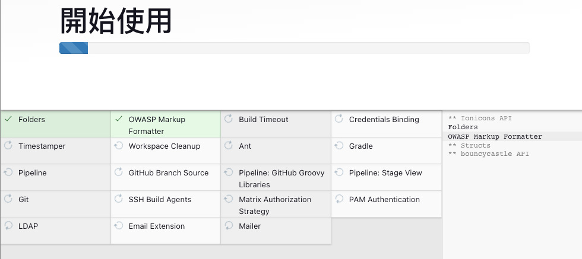

### 啟動 jenkin 做管理設定

```
docker-compose up -d
```
進入 http://localhost:8080 後


會需要輸入一個預設密碼

需要使用以下指令讀取該密碼並且輸入

```
docker exec jenkins cat /var/jenkins_home/secrets/initialAdminPassword
```

初始設定

需要設定管理員帳密

第一次進入會需要下載套建，選擇左邊即可





### 設定 agent
---

產生一組 ssh key 來做與 jenkin 溝通的認証

```
ssh-keygen -t ed25519 -f jenkin_keys -C "jenkins" 
```

會產生一組 jenkin_keys.pub 與 jenkin_keys 的公鑰與私鑰

<h3>把密鑰加入 jenkins 管理 -> Credentials -> System</h3>